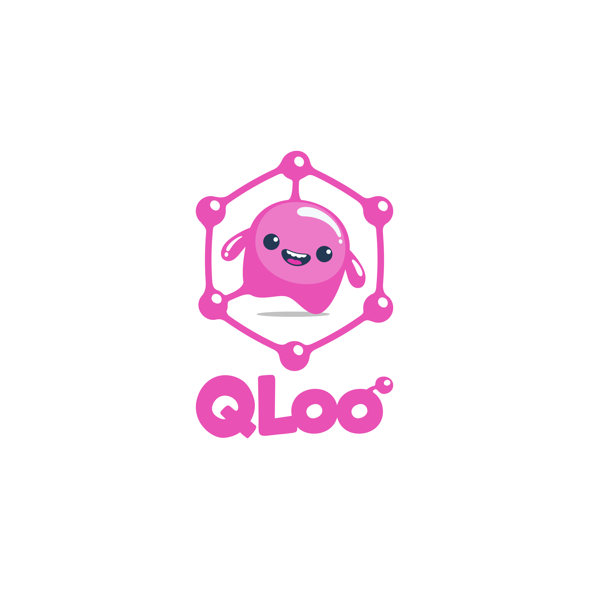
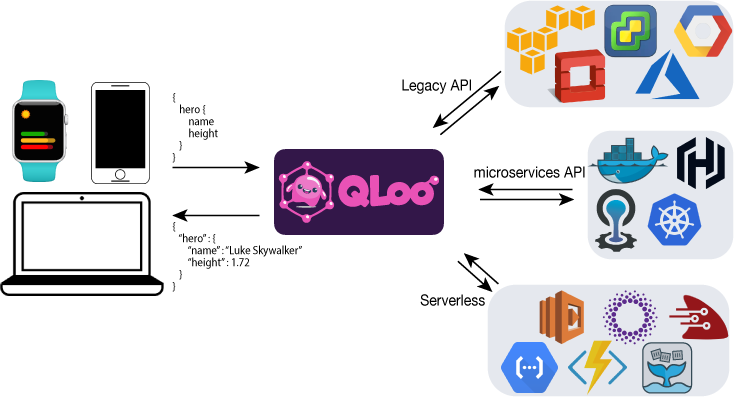

<h1 align="center">
     
  The Codeless GraphQL Server
</h1>

### What is QLoo?

QLoo is a GraphQL Server built on top of [Gloo](https://github.com/solo-io/gloo) and the [Envoy Proxy](https://envoyproxy.io).

QLoo leverages Gloo's function registry and Envoy's advanced HTTP routing features to provide a GraphQL frontend
for REST/gRPC applications and serverless functions. QLoo routes requests to data sources via Envoy, leveraging 
Envoy [HTTP filters](https://www.envoyproxy.io/envoy/latest/api-v2/config/filter/filter.html?highlight=http%20filter) 
for security, load balancing, and more.

 

    
 
    
## Workflow with QLoo
* Register or Discovery API Endpoints and Serverless Functions with Gloo
* Upload a GraphQL schema 
* Connect Functions to your Schema's fields in a QLoo ResolverMap

## Features
* **Codeless GraphQL API**: Instantly deploy a GraphQL server and connect it to your data sources with configuration,
zero code required.
* **Dynamic Load Balancing**: Load balance traffic across multiple data sources.
* **Health Checks**: Active and passive monitoring of your data sources.
* **OpenTracing**: Monitor GraphQL requests using the well-supported OpenTracing standard
* **Monitoring**: Export HTTP metrics to Prometheus or Statsd
* **Client SSL**: Communicate with Data Sources using TLS encryption 
* **Declarative API**: QLoo features a declarative YAML-based API; store your configuration as code and commit it with your projects.
* **Scalability**: QLoo scales independently of your data sources and scales infinitely.
* **Performance**: QLoo leverages Envoy for its high network performance and low footprint.
* **Plugins**: QLoo leverage's [Gloo's plugin ecosystem](https://gloo.solo.io/plugins/aws/) to enable extending the types
of data sources QLoo can connect to.
* **JSON-to-gRPC transcoding**: Connect GraphQL JSON clients to gRPC data sources.

**Service Discovery**:
* Kubernetes
* OpenShift
* HashiCorp Stack (Vault, Consul, Nomad)
* Cloud Foundry

**Function Discovery**:
* AWS Lambda
* Microsoft Azure Functions
* Google Cloud Platform Functions
* Fission
* OpenFaaS
* ProjectFn
* Swagger/REST
* gRPC

## Documentation

### Installation:
* [Installing locally Docker-Compose](installation/kubernetes.md): Installation guide for Docker-Compose (easiest way to get started)
* [Installing on Kubernetes](installation/kubernetes.md): Installation guide for Kubernetes

### Getting Started:
* [Getting Started on Kubernetes](getting_started/kubernetes/1.md): Getting started with Kubernetes (recommended for first time users)
* [Function Routing on Kubernetes](getting_started/kubernetes/2.md): Introduction to Function Routing with QLoo
* [Getting Started on OpenShift](getting_started/openshift/1.md): Getting started with OpenShift
* [Function Routing on OpenShift](getting_started/openshift/2.md): Introduction to Function Routing with QLoo (OpenShift version)
* [AWS Lambda](getting_started/aws/lambda.md): Basic AWS Lambda with QLoo

### v1 API reference:
* [Schemas](v1/schema.md): API Specification for proving your GraphQL Schemas to QLoo
* [ResolverMaps](v1/resolver_map.md): API Reference for ResolverMaps, which map your data sources to your Schemas

Blogs & Demos
-----
* [Announcement Blog](https://medium.com/solo-io/TODO)

Community
-----
Join us on our slack channel: [https://slack.solo.io/](https://slack.solo.io/)

---

### Thanks

**QLoo** would not be possible without the valuable open-source work of projects in the community. We would like to extend 
a special thank-you to [Envoy](https://www.envoyproxy.io) and [gqlgen](https://github.com/vektah/gqlgen) server library.
